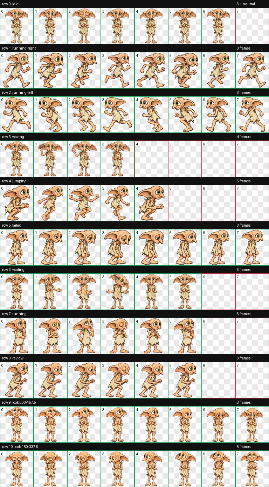

# Dobby — Codex Pet

A fan-made animated Dobby-inspired companion for the Codex desktop app. The package uses the v2 pet format with nine standard animations and sixteen look directions.



## Install

Copy `pet.json` and `spritesheet.webp` into:

```text
~/.codex/pets/dobby/
```

Restart Codex if the pet does not appear immediately.

Fan-made project for personal use. Not affiliated with OpenAI or the owners of the original character.
